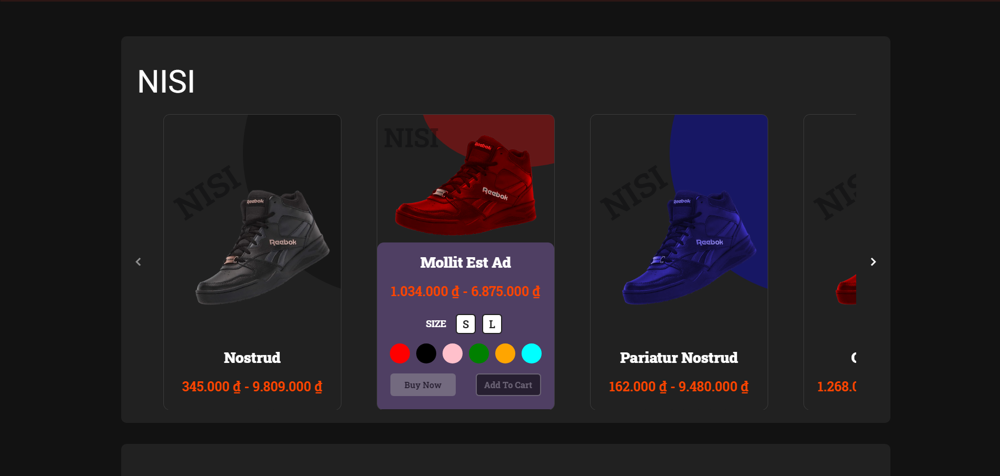

# Vue Sneaker

Live demo - [https://vue-sneaker.zitska.com/#/](https://vue-sneaker.zitska.com/#/)

## Why do I use `Vue`

`Vue3` similar to `ReactJS` + `Angular` (template).

- Pinia similar to Redux Toolkit + Redux Saga
- Vue router similar to ReactRouter
- Computed similar to useMemo
- Watch similar to useEffect
- Ref and Reactive similar to useState
- Provide + inject similar to reducer and context in React.
- etc.

In vue 3, I really like the setup script and `SFC` (which stands for Single File Component). It's easy to code and maintain.

## Technical detail

- Javascript version: `ES2022`
- `Vue ^3.3.4`
- `Pinia ^2.1.7`- Similar to `Redux` in `ReactJS`
- `Vue Router ^4.2.5` - Similar to `React Router`
- `Sass`,
- `TanStack Query (FKA Vue Query)` + `axios`
- `Vuetify` - I used `vuetify` because it's very similar to `MUI` in ReactJs. `Vuetify` contains many `bootstrap` classes. Like `grid`, `spacing`, `sizing`, `flex`, etc.
- Popular libraries such as: `zod`, `lodash`, etc.

## Features

- Search

- Pull sneakers from api and render its.

- Add/remove/edit shopping cart

- Responsive resizing for mobiles, tablets, laptops and PC.

- Multiple Themes (`System theme`, `Dark`, `Light`, `Blue`).

## Review

